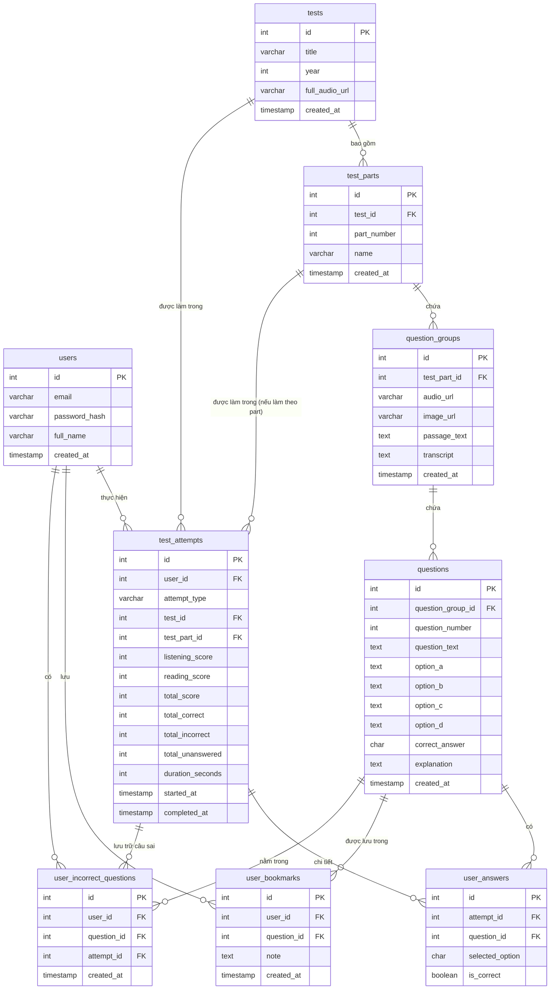

# Database Schema Documentation

Tài liệu này mô tả cấu trúc cơ sở dữ liệu (Database Schema) cho ứng dụng luyện thi TOEIC.

## Entity Relationship Diagram (ERD)

## Chi tiết các bảng (Tables)

### 1. `users`
Lưu trữ thông tin tài khoản người dùng ứng dụng.
- `id` (SERIAL/PK): ID người dùng.
- `email` (VARCHAR 255, UNIQUE): Địa chỉ email dùng để đăng nhập.
- `password_hash` (VARCHAR 255): Mật khẩu đã được mã hóa.
- `full_name` (VARCHAR 255): Tên đầy đủ của người dùng.
- `created_at` (TIMESTAMP): Thời gian tạo tài khoản.

### 2. `tests`
Lưu trữ danh sách các đề thi TOEIC.
- `id` (SERIAL/PK): ID đề thi.
- `title` (VARCHAR 255): Tên đề thi (VD: "2022 Test1").
- `year` (INT): Năm xuất bản của đề thi (VD: 2022).
- `full_audio_url` (VARCHAR 500): Đường dẫn đến file audio toàn bộ đề thi (nếu có).
- `created_at` (TIMESTAMP): Thời gian tạo.

### 3. `test_parts`
Lưu trữ thông tin 7 Part của mỗi đề thi TOEIC.
- `id` (SERIAL/PK): ID của part.
- `test_id` (INT/FK): Liên kết tới bảng `tests`.
- `part_number` (INT): Số thứ tự part (từ 1 đến 7).
- `name` (VARCHAR 255): Tên của part (VD: "Photographs", "Question-Response").
- `created_at` (TIMESTAMP): Thời gian tạo.

### 4. `question_groups`
Lưu trữ nhóm câu hỏi dùng chung một đoạn văn (passage), hình ảnh, hoặc file nghe nhỏ. Đối với Part 5 (Incomplete Sentences) mỗi câu có thể có một nhóm riêng rỗng hoặc gộp chung tùy vào cách xử lý, script hiện tại tạo group riêng cho mỗi nhóm thông tin context.
- `id` (SERIAL/PK): ID của nhóm câu hỏi.
- `test_part_id` (INT/FK): Liên kết tới bảng `test_parts`.
- `audio_url` (VARCHAR 500): File nghe riêng cho nhóm câu hỏi.
- `image_url` (VARCHAR 500): Ảnh đính kèm cho nhóm câu hỏi.
- `passage_text` (TEXT): Đoạn văn bài đọc (thường cho Part 6, 7).
- `transcript` (TEXT): Đoạn transcript của file nghe.
- `created_at` (TIMESTAMP): Thời gian tạo.

### 5. `questions`
Lưu trữ từng câu hỏi chi tiết.
- `id` (SERIAL/PK): ID câu hỏi.
- `question_group_id` (INT/FK): Liên kết tới bảng `question_groups`.
- `question_number` (INT): Số thứ tự câu hỏi trong bài thi (1-200).
- `question_text` (TEXT): Nội dung câu hỏi (có thể NULL cho Part 1, 2).
- `option_a`, `option_b`, `option_c`, `option_d` (TEXT): Nội dung các đáp án A, B, C, D.
- `correct_answer` (CHAR 1): Đáp án đúng (A, B, C, hoặc D).
- `explanation` (TEXT): Lời giải thích/dịch nghĩa.
- `created_at` (TIMESTAMP): Thời gian tạo.

### 6. `test_attempts`
Lưu trữ lịch sử, kết quả làm bài của người dùng (có thể làm full đề hoặc làm từng part).
- `id` (SERIAL/PK): ID lượt làm bài.
- `user_id` (INT/FK): Liên kết tới bảng `users`.
- `attempt_type` (VARCHAR 50): Loại làm bài (Chỉ chấp nhận 'FULL' hoặc 'PART').
- `test_id` (INT/FK): Liên kết tới `tests`.
- `test_part_id` (INT/FK): Liên kết tới `test_parts` (NULL nếu làm 'FULL').
- `listening_score`, `reading_score`, `total_score` (INT): Điểm thi tính theo thang điểm TOEIC.
- `total_correct`, `total_incorrect`, `total_unanswered` (INT): Số câu đúng, sai, chưa trả lời.
- `duration_seconds` (INT): Tổng thời gian làm bài tính bằng giây.
- `started_at` (TIMESTAMP): Thời gian bắt đầu làm.
- `completed_at` (TIMESTAMP): Thời gian nộp bài.

### 7. `user_answers`
Lưu chi tiết từng câu trả lời của user trong 1 lượt làm bài.
- `id` (SERIAL/PK): ID câu trả lời.
- `attempt_id` (INT/FK): Liên kết tới `test_attempts`.
- `question_id` (INT/FK): Liên kết tới `questions`.
- `selected_option` (CHAR 1): Lựa chọn của người dùng (A, B, C, D).
- `is_correct` (BOOLEAN): Đánh dấu câu trả lời này đúng hay sai (giúp query nhanh hơn).

### 8. `user_incorrect_questions`
Lưu lại các câu hỏi mà user đã trả lời sai để tiện review, luyện tập lại.
- `id` (SERIAL/PK): ID bản ghi.
- `user_id` (INT/FK): Liên kết tới `users`.
- `question_id` (INT/FK): Liên kết tới `questions`.
- `attempt_id` (INT/FK): Liên kết tới `test_attempts` để biết sai ở lượt thi nào.
- `created_at` (TIMESTAMP): Thời gian tạo.

### 9. `user_bookmarks`
Chức năng người dùng đánh dấu/lưu lại (bookmark) những câu hỏi hay hoặc khó.
- `id` (SERIAL/PK): ID bản ghi.
- `user_id` (INT/FK): Liên kết tới `users`.
- `question_id` (INT/FK): Liên kết tới `questions`.
- `note` (TEXT): Ghi chú riêng của user về câu hỏi này.
- `created_at` (TIMESTAMP): Thời gian lưu.
